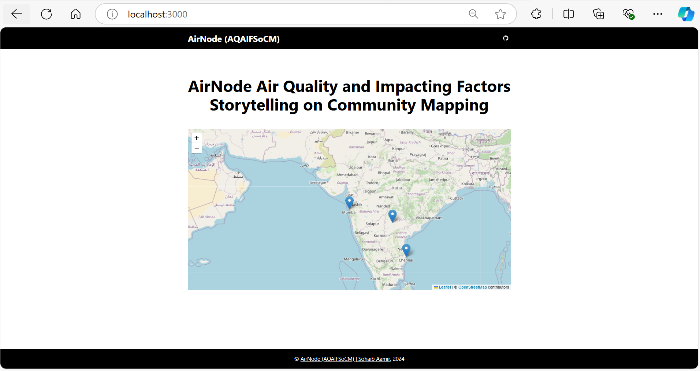

# AirNode-NASA-SpaceApp2024
# AirNode Air Quality and Impacting Factors Storytelling on Community Mapping

 <!-- Update the logo path if available -->

## High-Level 

https://air-node-nasa-space-app-2024.vercel.app/ 

air-quality-prediction-algorithm.ipynb is in public folder.

We developed an interactive dashboard that analyzes and visualizes air quality data in **Hyderabad**, **Chennai**, and **Mumbai** during the Diwali festivities. The dashboard uses GIS mapping and storytelling formats to present the data in an accessible way for both novice users and expert researchers. It incorporates real-time data from air quality sensors, satellite data, and other open datasets to provide a comprehensive view of air pollution levels and their impact factors.

The project addresses the challenge of understanding and mitigating air pollution during Diwali, a time when air quality significantly deteriorates due to increased fireworks, traffic, and industrial activity. By providing a platform that visualizes air quality variations and correlates them with specific impact factors, the dashboard helps users identify pollution hotspots and understand the underlying causes. For novice users, it offers practical advice on how to avoid polluted areas, while for researchers, it highlights data gaps and opportunities for further study.

Air pollution is a major health concern, especially in urban areas during festive seasons like Diwali. This project is important because it not only raises awareness about the severity of air pollution but also empowers communities and researchers with the tools they need to take informed actions. By promoting the use of open data and advanced analytics, the project aims to drive better air quality management and policy-making, ultimately contributing to healthier living environments in Indian cities.

## Project Demo
https://youtube.com/playlist?list=PLu-CCIM-WT1Q5Vdjap0qF8_OgvsgcH08n&si=FdDEPUWhi0PnvJU6

## Final Project
https://github.com/SohaibAamir28/AirNode-SpaceApps2024

## Project Details
This project focuses on air quality analysis and impact factors that can be correlated with air quality measurements, forecasts, and modeling. It presents a specific use case of **Hyderabad**, **Chennai**, and **Mumbai** 2018 to 2023 during the Diwali festivities to determine how variations can be identified. Furthermore, the data is displayed in a storytelling format, tailored to two user roles:
1. **Novice User**: Aims to determine how to avoid air pollution or understand how air pollution varies in specific urban zones.
2. **Researcher**: A NASA employee or other air quality or climate researcher/manager looking to identify available datasets for further research initiatives.

This initiative emphasizes the lack of available air quality data in Indian urban zones compared to what is accessible for the United States. Many air quality sensors are being installed, yet their data is not becoming openly available initially. This project showcases the benefits of open data for environmental improvement and solving the significant air pollution problem in Indian cities.

## Use of Artificial Intelligence
This initiative applied artificial intelligence to air quality measurements from specific IoT sensors to predict air quality measurements. These air quality measurements are openly available through open science and open dataset licenses. The sources include Indian state sources used by the government to regulate air quality to meet national and international regulations. Additionally, data from the OpenAQ repository provides a comprehensive global air quality dataset.

The AI algorithms learn patterns from specific IoT air quality sensors, increasing prediction accuracy as more openly available datasets are used to train the models.

### Space Agency Data
- NASA's MODIS
- National Air Quality Index (CPCB)
- India Air Quality Index (AQI)

## Table of Contents
- [Features](#features)
- [Technologies Used](#technologies-used)
- [Getting Started](#getting-started)
- [Project Structure](#project-structure)
- [Components](#components)
- [API Integration](#api-integration)
- [Contributing](#contributing)
- [License](#license)
- [Acknowledgments](#acknowledgments)

## Features
- Interactive map showing the air quality of major cities in India: **Mumbai**, **Hyderabad**, and **Chennai**.
- Dynamic display of air quality statistics for each city using real-time data from the OpenAQ API.
- Responsive design to ensure a seamless experience across various devices.
- Display of city descriptions and air quality levels when markers on the map are clicked.
- Easy navigation and user-friendly interface.

## Technologies Used
- **Next.js**: A React framework for building server-rendered and statically generated web applications.
- **React**: A JavaScript library for building user interfaces.
- **Leaflet**: A JavaScript library for interactive maps.
- **Axios**: A promise-based HTTP client for making API requests.
- **CSS Modules**: For scoped and modular styles.
- **OpenAQ API**: For fetching real-time air quality data.

## Getting Started

### Prerequisites
- Node.js (>= 14.x)
- npm (>= 5.x)

### Installation
1. Clone the repository:
   ```bash
   git clone https://github.com/SohaibAamir28/AirNode-Air-Quality-NASA-Project.git
   cd AirNode-Air-Quality-NASA-Project
